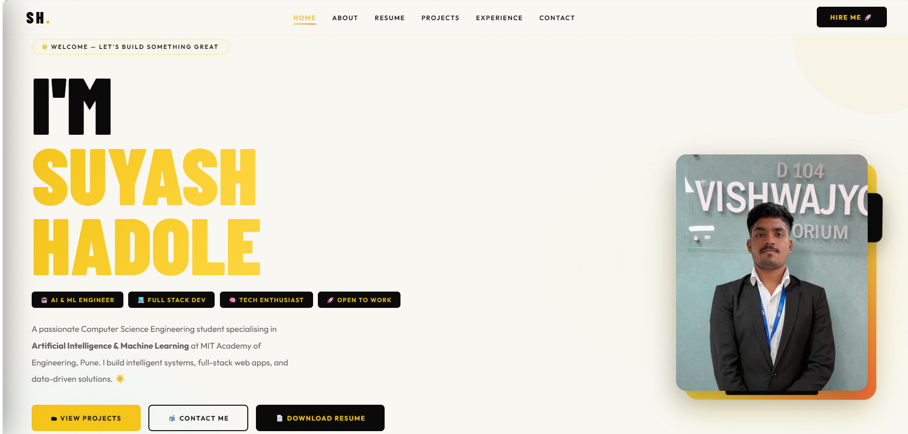

<h1 align="center">Hi 👋, I'm Suyash Hadole</h1>

<h3 align="center">
🚀 AI & ML Enthusiast | CSE-AIML Student | AAAI Member
</h3>

<p align="center">
  <a href="https://suyash-portfolio.github.io/suyash-portfolio/">
    
  </a>

  <a href="https://www.linkedin.com/in/suyash-hadole/">
    
  </a>

  
</p>

---

# 👨‍💻 Portfolio Preview

<p align="center">
  <a href="https://suyash-portfolio.github.io/suyash-portfolio/" target="_blank">
      
  </a>
</p>

```markdown
---

---

# 📄 Resume

<p align="center">
  <a href="./resume.pdf" target="_blank">
    
  </a>
</p>

<p align="center">
  <a href="./resume.pdf" target="_blank">
    
  </a>
</p>

<p align="center">
  <i>Click the preview above to view my complete resume.</i>
</p>

---


# 📈 GitHub Activity

<p align="center">
  
</p>

<p align="center">
  
</p>

---

# 🚀 About Me


🎓 Pursuing **B.Tech in Computer Science Engineering (AIML)** at  
**MIT Academy of Engineering (MITAOE), Pune**

💡 Passionate about:
- Artificial Intelligence & Machine Learning
- Full Stack Web Development
- Data Science & Intelligent Systems
- Real-world Problem Solving

🏆 Currently serving as:
- AAAI Membership & Outreach Coordinator
- IIT Delhi BEcon' 2026 Campus Ambassador

🌱 Continuously learning:
- Advanced Machine Learning
- Modern Web Technologies
- AI-powered Applications

---

# 🛠 Tech Stack

## 💻 Languages
<p>

</p>

## 🤖 AI / ML / Data
<p>


</p>

## ⚒️ Tools & Platforms
<p>


</p>

---

# 📂 Featured Projects

## 🌱 GrowTogether – Smart Farming Platform
🔹 AI-powered agriculture support system  
🔹 Land verification & payment tracking  
🔹 Crop monitoring dashboard  
🔹 Focused on solving real-world farmer problems  

---

## 🤖 MITAOE Chatbot
🔹 AI-based student assistance chatbot  
🔹 Handles academic & college-related queries  
🔹 Improves accessibility of information  

---

## 📊 SQL Data Analysis Project
🔹 Data-driven insights using SQL  
🔹 Real-world dataset analysis  
🔹 Reporting & visualization techniques  

---

# 🏆 Achievements

🥈 IIT Delhi Campus Ambassador for BEcon' 2026  
🏅 Best Glorification Award  
🤝 AAAI Leadership & Outreach Role  
💡 Active participation in AI & Tech Communities  

---

# 📬 Connect With Me

<p align="center">
  <a href="mailto:suyashhadole14@gmail.com">
    
  </a>

  <a href="https://www.linkedin.com/in/suyash-hadole/">
    
  </a>

  <a href="https://github.com/Suyash-portfolio">
    
  </a>
</p>

---

<h3 align="center">
⭐ If you like my work, consider giving a star to my repositories!
</h3>
